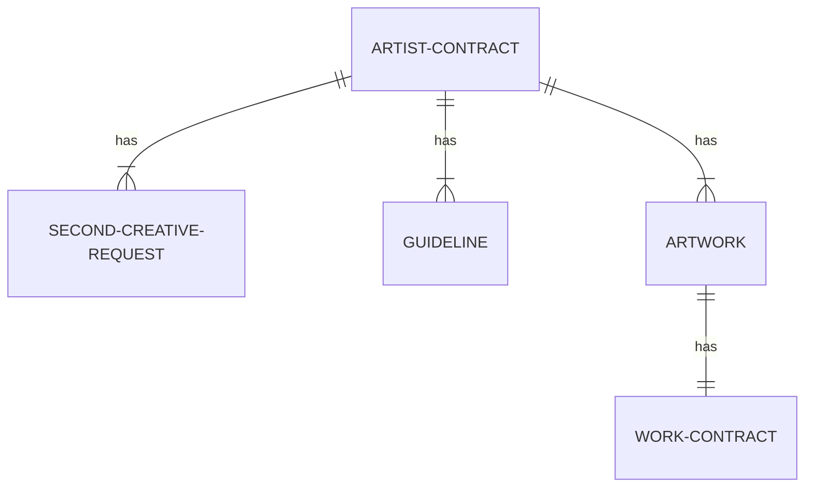
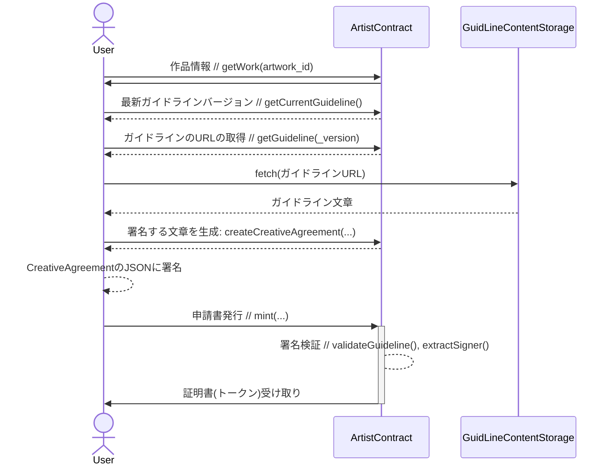

Bright Licensable Work NFT

# 目次
- [目次](#目次)
- [別ページ](#別ページ)
- [概要](#概要)
- [何を目指すのか？](#何を目指すのか)
  - [2次創作活動への壁を減らす](#2次創作活動への壁を減らす)
  - [ファンが2次創作を安心して好きになれるようする](#ファンが2次創作を安心して好きになれるようする)
- [解決されなくても良しとする問題](#解決されなくても良しとする問題)
- [データ関係図](#データ関係図)
- [データ構成](#データ構成)
  - [ArtistContract](#artistcontract)
  - [WorkContract](#workcontract)
  - [Artwork](#artwork)
  - [Guideline](#guideline)
  - [SecondCreativeRequest](#secondcreativerequest)
  - [CreativeAgreement](#creativeagreement)
- [API仕様](#api仕様)
- [フロー図](#フロー図)
  - [申請フロー](#申請フロー)

# 別ページ
- [フロー図](/document/%E3%83%95%E3%83%AD%E3%83%BC%E5%9B%B3.md)

# 概要
Bright Licensable Work NFTは、二次創作活動における問題を解決するための非中央集権型プラットフォームの開発フレームワークです。このフレームワークは、ブロックチェーン技術とスマートコントラクトを用いたSolidityによって構築されています。アーティスト、ファン、そして二次創作者間での信頼と透明性を確立することを目指しています。

アーティストは、このフレームワークを利用して自身の作品に対するガイドラインを公開し、二次創作活動者からの申請を管理することができます。これにより、二次創作のための許可申請プロセスが自動化され、公平で透明な方式で管理されるようになります。

さらに、ファンは二次創作者が適切な申請を行っているかを簡単に確認できます。その結果、ファンは二次創作を安心して楽しむことができます。

Bright Licensable Work NFTは、二次創作活動における信頼と透明性を強化するための革新的なソリューションを提供します。

# 何を目指すのか？
## 2次創作活動への壁を減らす
- ガイドラインをオープンな場所に設置できる。
- 1次創作元への利用申請フォームを設置できる。
- 申請書を自動・公平・オープンに管理できる。
## ファンが2次創作を安心して好きになれるようする
- 利用者は電子署名をして、ガイドラインに沿って作成したことを証明できる。
- ファンは2次創作者が申請書を提出しているかを簡単に確認できる。
- ファンは申請内容の正当性を読み取ることができる。

# 解決されなくても良しとする問題
- 偽物の申請フォーム・作品が出てくる。
- 利用できる範囲をカテゴライズして管理する。
- 利用範囲によって、使用料を変える。

# データ関係図

# データ構成
## ArtistContract
| Attribute/Function | Description |
| --- | --- |
| artistName | string |
| description | string |
| guidelines | linked to Guideline via versionId |
| works | linked to Artwork via artworkId |
| createAgreement() | returns CreativeAgreement |
| mintApplication() | returns SecondCreativeRequest |
| verifySignature() | returns boolean |
| tokenURI() | no return type specified |

## WorkContract

| Attribute/Function | Description |
| --- | --- |
| tokenURI() | no return type specified |

## Artwork

| Attribute/Function | Description |
| --- | --- |
| fundWallet | no type specified |
| contractAddress? | optional, no type specified |
| tokenId? | optional, no type specified |
| title | no type specified |
| authors | array of strings |
| createdAt | no type specified |
| mediaURL | no type specified |
| mediaDigest | no type specified |
| minValue | no type specified |
| maxValue | no type specified |
| maxDate | no type specified, comment: 1year? |

## Guideline

| Attribute/Function | Description |
| --- | --- |
| url | no type specified |
| digest | no type specified |
| updatedAt | no type specified |

## SecondCreativeRequest

| Attribute/Function | Description |
| --- | --- |
| name | no type specified, comment: NFT name |
| description | no type specified, comment: explanation about permission |
| image | no type specified, comment: random |
| contractAddress | no type specified |
| tokenId | no type specified |
| artworkId | no type specified |
| signerName | no type specified |
| signerAddress | no type specified |
| purpose | no type specified |
| location | no type specified |
| startDate | no type specified |
| endDate | no type specified |
| createdDate | no type specified |
| value | no type specified |
| guildLineVerId | no type specified |
| signature | no type specified |

## CreativeAgreement

| Attribute/Function | Description |
| --- | --- |
| applicationAddress | no type specified |
| artworkId | no type specified, comment: for reference to artwork |
| signerName | no type specified |
| signerAddress | no type specified |
| purpose | no type specified |
| location | no type specified |
| startDate | no type specified |
| endDate | no type specified |
| value | no type specified |
| guildLineVerId | no type specified, comment: to get URL and digest |
| guidlineContent | no type specified, comment: want to sign the text |

# API仕様
| 関数 | 種類 | 説明 | 引数 |
| --- | --- | --- | --- |
| constructor | Deployment | トークンの初期化（名前、シンボル、説明、画像URL） | _name: string, _symbol: string, _baseTokenURI: string |
| addWork | アーティスト用 | 新たなアートワークを追加 | _workId: uint256, _totalSupply: uint256, _metadata: string |
| deactivateWork | アーティスト用 | 既存のアートワークを非活性化 | _workId: uint256 |
| addGuideline | アーティスト用 | ガイドラインを追加 | _guideline: string |
| forceBurn | アーティスト用 | 任意のトークンを破棄 | _tokenId: uint256 |
| mint | ユーザー用 | 新しいトークンを発行 | _workId: uint256 |
| burn | ユーザー用 | 所有するトークンを破棄 | _tokenId: uint256 |
| totalSupply | ユーザー用 | 発行済みトークンの総数を取得 | なし |
| getWork | 読取り専用 | アートワークの詳細を取得 | _workId: uint256 |
| getCurrentGuideline | 読取り専用 | 現在のガイドラインを取得 | なし |
| getGuideline | 読取り専用 | 特定のバージョンのガイドラインを取得 | _version: uint256 |
| tokenURI | 読取り専用 | トークンのURIを取得 | _tokenId: uint256 |

この表では各関数の引数の詳細も示しています。型と名前で示しています。

# フロー図

## 申請フロー
