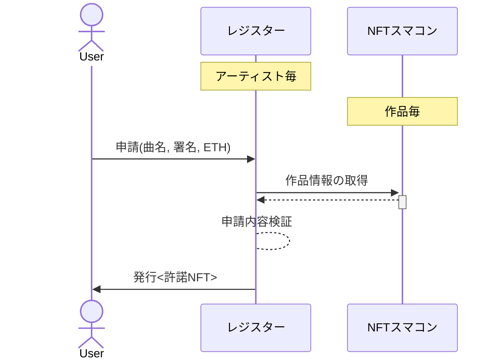

Bright Licensable Work NFT

# 目標
- 音楽などのNFTのライセンスの明確化。
- 許諾申請の自動化。
- ライセンス使用料の透明化。

# 許諾フロー

# 開発環境
## 環境設定ファイル
- `.env`
- `.env.local`

## hardhat
- ローカルネット起動
    - npx hardhat node
- ローカルでスクリプト実行
    -  npx hardhat run --network localhost scripts/local/foo.ts
- テストネットデプロイ
  - `hardhat.config.ts`にネットワーク情報を入れる。
  - npx hardhat run --network goerli scripts/deploy.ts
- Verify(etherscan)
  - npx hardhat verify --network goerli DEPLOYED_CONTRACT_ADDRESS ARGUMENTS_OF_CONSTRUCROR

## テストネットでデバッグ
- Goerliネットワーク
- デバッグ用アカウント
  - [!] 誰でも操作できるウォレットなので、取り扱い注意。
  - 公開アドレス：0xe757D1fB6A2841F7Cb9b74Aac491590eb77210b6
  - 秘密鍵：6074babd86f0cc13ecc3c4c6c78ff7b86962b90e2fe4e1a1771cc21c50b8c95e
  - メタマスクなどにインポートして使用する。
