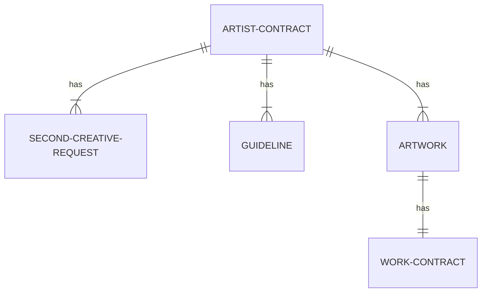
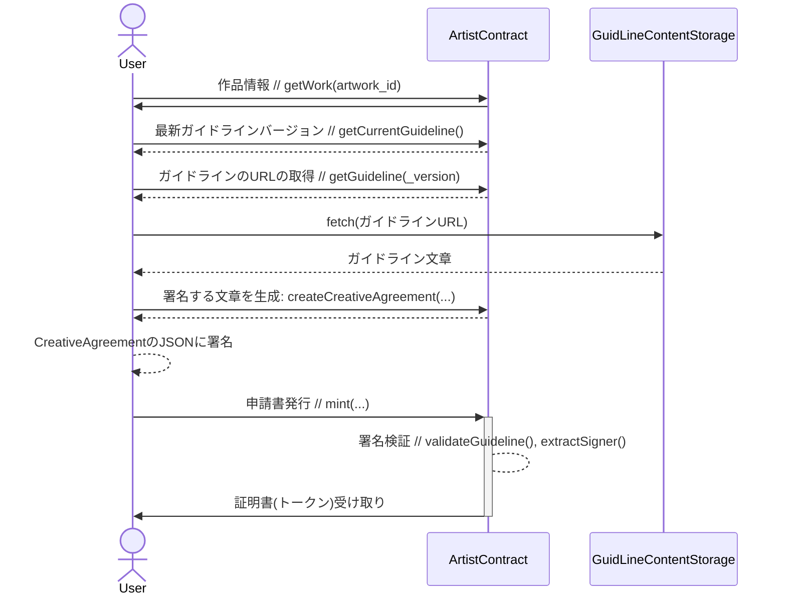

Bright Licensable Work NFT

# 目次
- [目次](#目次)
- [別ページ](#別ページ)
- [概要](#概要)
- [用語](#用語)
- [何を目指すのか？](#何を目指すのか)
  - [2次創作活動への壁を減らす](#2次創作活動への壁を減らす)
  - [ファンが2次創作を安心して好きになれるようする](#ファンが2次創作を安心して好きになれるようする)
- [解決されなくても良しとする問題](#解決されなくても良しとする問題)
- [データ関係図](#データ関係図)
- [データ構成](#データ構成)
  - [ArtistContract](#artistcontract)
  - [Artwork](#artwork)
  - [Guideline](#guideline)
  - [CreativeAgreement](#creativeagreement)
  - [SecondCreativeRequest](#secondcreativerequest)
- [API仕様](#api仕様)
- [フロー図](#フロー図)
  - [申請フロー](#申請フロー)

# 別ページ
- [フロー図](/document/%E3%83%95%E3%83%AD%E3%83%BC%E5%9B%B3.md)

# 概要
Bright Licensable Work NFTは、二次創作活動における問題を解決するための非中央集権型プラットフォームの開発フレームワークです。このフレームワークは、ブロックチェーン技術とスマートコントラクトを用いたSolidityによって構築されています。アーティスト、ファン、そして二次創作者間での信頼と透明性を確立することを目指しています。

アーティストは、このフレームワークを利用して自身の作品に対するガイドラインを公開し、二次創作活動者からの申請を管理することができます。これにより、二次創作のための許可申請プロセスが自動化され、公平で透明な方式で管理されるようになります。

さらに、ファンは二次創作者が適切な申請を行っているかを簡単に確認できます。その結果、ファンは二次創作を安心して楽しむことができます。

Bright Licensable Work NFTは、二次創作活動における信頼と透明性を強化するための革新的なソリューションを提供します。

# 用語

# 何を目指すのか？
## 2次創作活動への壁を減らす
- ガイドラインをオープンな場所に設置できる。
- 1次創作元への利用申請フォームを設置できる。
- 申請書を自動・公平・オープンに管理できる。
## ファンが2次創作を安心して好きになれるようする
- 利用者は電子署名をして、ガイドラインに沿って作成したことを証明できる。
- ファンは2次創作者が申請書を提出しているかを簡単に確認できる。
- ファンは申請内容の正当性を読み取ることができる。

# 解決されなくても良しとする問題
- 偽物の申請フォーム・作品が出てくる。
- 利用できる範囲をカテゴライズして管理する。
- 利用範囲によって、使用料を変える。

# データ関係図

# データ構成
## ArtistContract
複数作品とガイドライン、利用申請を管理するスマートコントラクト
| Attribute/Function | Description |
| --- | --- |
| artistName | コントラクトを管理するアーティストの名前 |
| description | コントラクトの説明 |
| guidelines | 更新履歴を保持するガイドライン |
| artworks | コントラクトから利用申請を出せる作品 |
| createAgreement() | 必要な情報から署名するメッセージを生成 |
| mint() | 利用証明書の発行(Soul Bound Token) |
| extractSigner() | 署名の検証を用いて署名者のアドレスを抽出 |
| tokenURI() | 発行済み利用証明書の取得 |

## Artwork
利用申請可能な作品の情報
| Attribute/Function | Description |
| --- | --- |
| fundWallet | 利用料の振込先アドレス |
| contractAddress? | 作品自体がNFT化されていればそのコントラクトアドレス |
| tokenId? | 作品自体がNFT化されていればそのトークンアドレス |
| title | 作品タイトル　 |
| authors | 作品の権利者の名前 |
| createdAt | 作品情報が登録された日付 |
| mediaURL | 作品のメディアデータがあるストレージのURL |
| mediaDigest | 作品のバイナリから生成されたhash値 |
| minValue | 利用料の最低金額 |
| maxValue | 利用料の最高金額 |
| maxDate | 利用期間の最大日数 |

## Guideline
内容が自由なガイドラインの管理フォーマット
| Attribute/Function | Description |
| --- | --- |
| url | ガイドラインのテキストデータがあるストレージURL |
| digest | ガイドラインURLから取得出来るテキストデータのHash値 |
| updatedAt | ガイドラインに更新された日時 |

## CreativeAgreement
利用者が署名するテキストデータの中身
| Attribute/Function | Description |
| --- | --- |
| contractAddress | 利用証明を発行するコントラクトのアドレス |
| artworkId | 利用する作品を識別する番号 |
| signerName | 利用者の名前 |
| signerAddress | 利用者の公開アドレス |
| purpose | 利用目的 |
| location | 利用する場所(URL, 住所など) |
| startDate | 利用を開始する日時 |
| endDate | 利用を終了する日時(最大利用可能日数内) |
| value | 利用料(最小最大の範囲で任意額) |
| guildLineVerId | 署名するガイドラインのバージョン |
| guidlineContent | 署名するガイドラインのテキストデータ |

## SecondCreativeRequest
利用証明書(トークン)
| Attribute/Function | Description |
| --- | --- |
| name | コントラクト名 |
| description | コントラクトの説明 |
| image | トークンのシンボル画像 |
| contractAddress | トークン発行元のコントラクトアドレス |
| tokenId | トークンの発行番号 |
| artworkId | 利用する作品の識別番号 |
| signerName | 署名した利用者の名前 |
| signerAddress | 署名した利用者の公開アドレス |
| purpose | 利用目的 |
| location | 利用場所 |
| startDate | 利用開始日時 |
| endDate | 利用終了日時 |
| createdDate | 証明書発行日時 |
| value | 支払った利用金額 |
| guildLineVerId | 署名したガイドラインのバージョン |
| signature | 署名したテキストデータ(CreativeAgreement)の署名値 |

# API仕様
| 関数 | 種類 | 説明 | 引数 |
| --- | --- | --- | --- |
| constructor | Deployment | トークンの初期化（名前、シンボル、説明、画像URL） | _name: string, _symbol: string, _baseTokenURI: string |
| addWork | アーティスト用 | 新たな作品を追加 | _workId: uint256, _totalSupply: uint256, _metadata: string |
| deactivateWork | アーティスト用 | 既存の作品を利用無効化 | _workId: uint256 |
| addGuideline | アーティスト用 | ガイドラインを追加 | _guideline: string |
| forceBurn | アーティスト用 | 任意の証明書を強制破棄 | _tokenId: uint256 |
| mint | ユーザー用 | 新しい証明書を発行 | _workId: uint256 |
| burn | ユーザー用 | 所有する証明書を破棄 | _tokenId: uint256 |
| totalSupply | ユーザー用 | 発行済み証明書の総数を取得 | なし |
| getWork | 読取り専用 | アートワークの詳細を取得 | _workId: uint256 |
| getCurrentGuideline | 読取り専用 | 現在のガイドラインを取得 | なし |
| getGuideline | 読取り専用 | 特定のバージョンのガイドラインを取得 | _version: uint256 |
| tokenURI | 読取り専用 | トークンのURIを取得 | _tokenId: uint256 |

この表では各関数の引数の詳細も示しています。型と名前で示しています。

# フロー図

## 申請フロー
