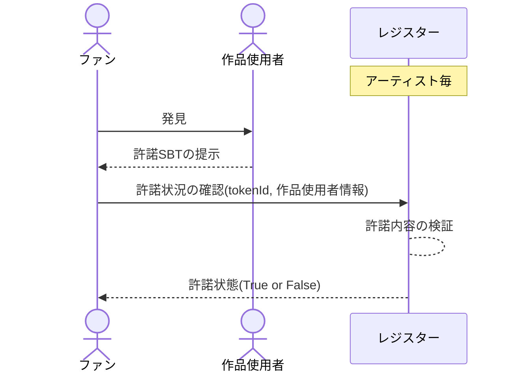
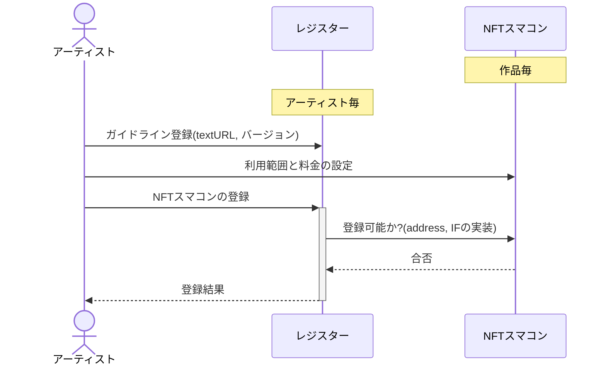

# ファンによる検証

```mermaid
sequenceDiagram
    actor ファン;
    actor 作品使用者;
    participant レジスター;
    Note over レジスター: アーティスト毎
    ファン ->> 作品使用者: 発見
    作品使用者 -->> ファン: 許諾SBTの提示
    ファン ->> レジスター: 許諾状況の確認(tokenId, 作品使用者情報)
    レジスター --> レジスター: 許諾内容の検証
    レジスター -->> ファン: 許諾状態(True or False)
```
# アーティストの登録作業

```mermaid
sequenceDiagram
    actor アーティスト;
    participant レジスター;
    participant NFTスマコン;
    Note over NFTスマコン: 作品毎
    Note over レジスター: アーティスト毎
    アーティスト ->> レジスター: ガイドライン登録(textURL, バージョン)
    アーティスト ->> NFTスマコン: 利用範囲と料金の設定
    アーティスト ->>+ レジスター: NFTスマコンの登録
    レジスター ->> NFTスマコン: 登録可能か?(address, IFの実装)
    NFTスマコン -->> レジスター: 合否
    レジスター -->>- アーティスト: 登録結果
```